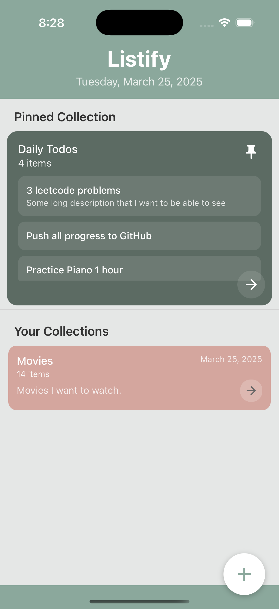
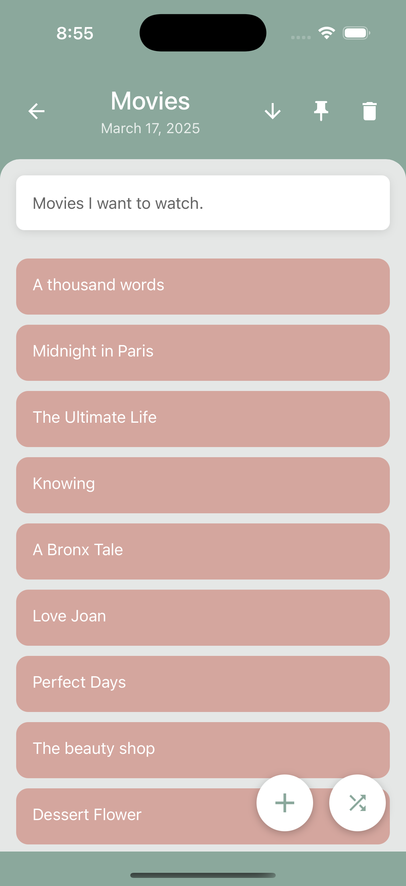

# Listify - A Thought Management App

Listify helps you manage your thoughts through organized lists and notes. Whether you're brainstorming ideas, managing tasks, or keeping track of random thoughts, Listify makes it easy to stay organized.

Key Features:
- Create and manage lists and notes
- Get a random entry from any list for inspiration
- Pin your most important lists to the home screen for quick access
- More features coming soon!

Feel free to add new features, suggest improvements, or report issues.

## Installation
To run the app locally, follow these steps:
1. **Clone the repository:**
   ```bash
   git clone https://github.com/username/listify.git
   cd listify
2. **Backend:**
   cd backend
   install dependencies - npm install
   run npm start
3. **Frontend:**
   cd frontend
   install dependencies - npm install
   run React-Native app via IOS Simulator - npx react-native run-ios
   run React-Native app via Andriod Simulator - npx react-native run-android

## Contributing
Contributions are welcome! Fork the repo, create a feature branch, and submit a pull request.

## License
No license yet.

## UI images


